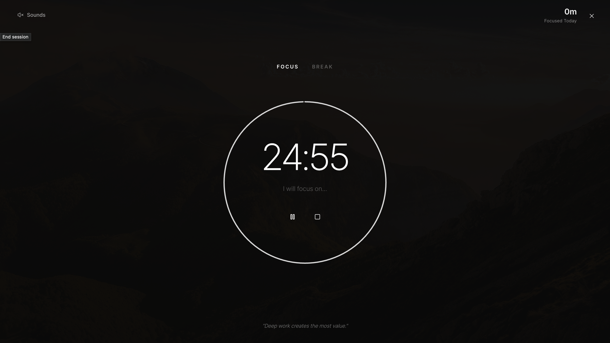
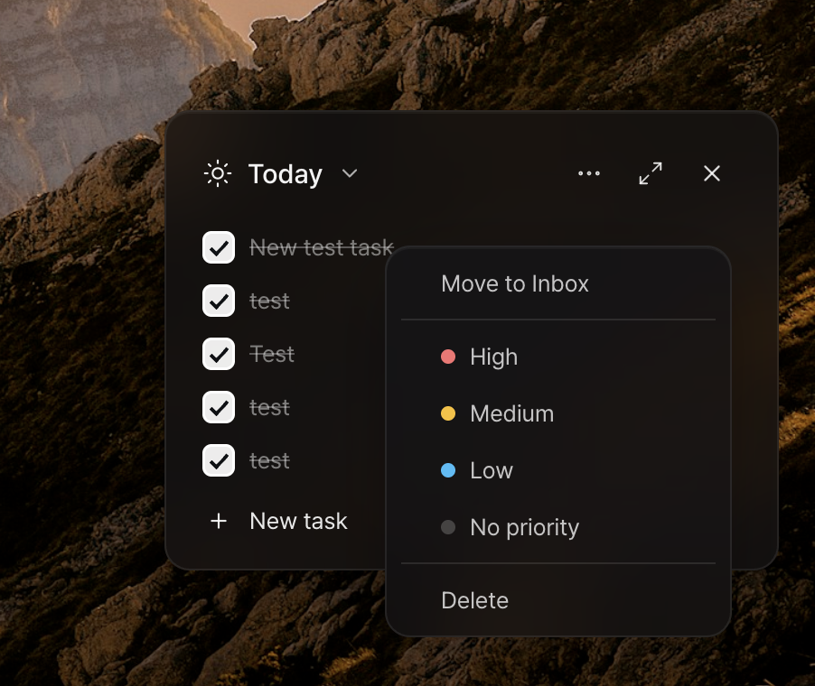
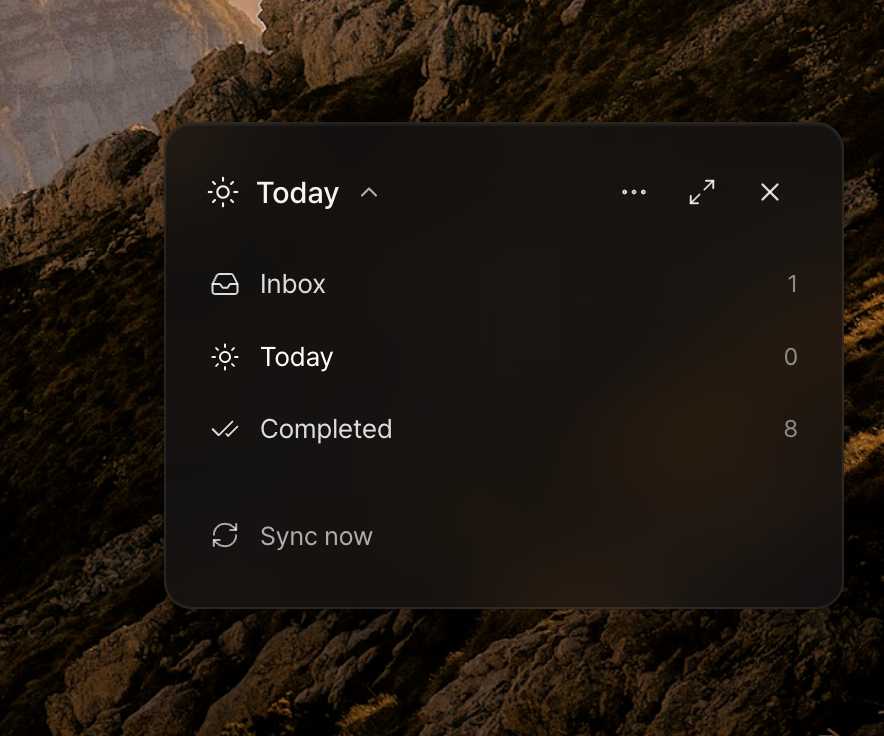
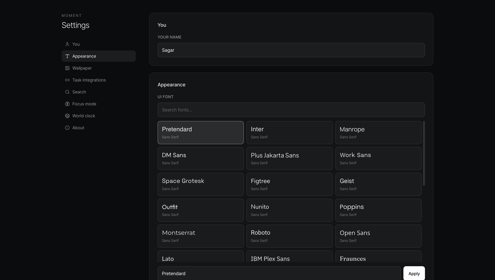

# Moment — A Beautiful New Tab

**Moment** is an open-source alternative to the [Momentum](https://chromewebstore.google.com/detail/momentum/laookkfknpbbblfpciffpaejjkokdgca?hl=en) new-tab experience: a calm dashboard with wallpapers, focus, tasks, and integrations—without locking project-management features behind a paid tier.

---

## Screenshots

<p align="center">
  
  
  
  <br />
  
  
  
  <br />
  
  
  
  <br />
  
</p>

---

## Why this exists

The original **Momentum** extension keeps integrations with project-management tools behind **Momentum Plus**. This project was developed so you can get a similar daily dashboard—**with Asana and Linear wired in by default** (bring your own API keys)—without that paywall on core productivity workflows.

**Inspired by:** [Momentum — Chrome Web Store](https://chromewebstore.google.com/detail/momentum/laookkfknpbbblfpciffpaejjkokdgca?hl=en)

---

## What you get

- **Wallpapers** — Daily Unsplash landscapes (with a curated offline fallback). **Click the location / “Unsplash” label** in the footer to load a new random wallpaper.
- **Asana & Linear** — Optional sync: configure tokens in settings; Linear issues and Asana tasks can flow through your lists.
- **Focus mode** — Timed sessions with a soft site nudge overlay. **Rain sound** included to start; more ambient options in settings.
- **Search** — Google / DuckDuckGo / Bing (`/` or `⌘K` / `Ctrl+K`).
- **Weather** — Current conditions (Open-Meteo, no API key).
- **Task stats** — Analytics panel: completed tasks, focus minutes, trends.
- **World clock** — Multiple IANA timezones from the top bar.
- **Tasks** — Simple **Inbox**, **Today**, and **Completed** tabs; **priority** (high / medium / low), drag-to-reorder, context menu for moves and sync actions.

---

## Local setup

```bash
git clone https://github.com/sagarchauhan005/moment.git
cd moment
npm install
npm run build
```

Load in Chrome:

1. Open `chrome://extensions`
2. Turn on **Developer mode** (top right)
3. **Load unpacked** → choose the `dist/` folder
4. Open a new tab

Hot-reload while developing:

```bash
npm run dev
# Load dist/ as the unpacked extension; it rebuilds on save
```

### Configuration

Open settings via the **gear** icon (bottom-left on the new tab):

| Setting | Description |
|--------|-------------|
| **Your name** | Greeting |
| **UI font** | Any Google Font |
| **Unsplash access key** | Optional — [unsplash.com/developers](https://unsplash.com/developers) |
| **Linear API key** | Linear → Settings → Account → API |
| **Asana token** | Asana → My settings → Apps → Personal access tokens |
| **Focus sites** | Hostnames for the soft-block overlay during focus |
| **World clock cities** | Label + IANA timezone |
| **Search engine** | Google, DuckDuckGo, or Bing |

---

## TODO

- **Calendar integration**
- **More project-management tool integrations**
- **More ambient audio** beyond the current set

---

## Architecture (overview)

```
src/
  background/     # MV3 service worker — alarms, sync, focus end
  content/          # focus-gate soft-block script
  newtab/           # React new-tab UI
  options/          # Settings page
  lib/              # Asana, Linear, tasks, sounds, Unsplash, storage, …
```

State lives in `chrome.storage.local`; `useMoment` listens to `onChanged` for live updates.

---

## Privacy

- Data stays in **`chrome.storage.local`**
- Network: Unsplash (optional), Asana/Linear when configured, Open-Meteo for weather
- No telemetry or analytics

---

## Contributors

See [CONTRIBUTORS.md](CONTRIBUTORS.md) — including [Claude](https://www.anthropic.com/claude) and [Cursor](https://cursor.com) as development assistants.

---

## Contributing

Pull requests welcome. For larger changes, open an issue first.

```bash
npm run dev    # dev build with HMR
npm run build  # production → dist/
```

---

## License

MIT — do whatever you'd like.
