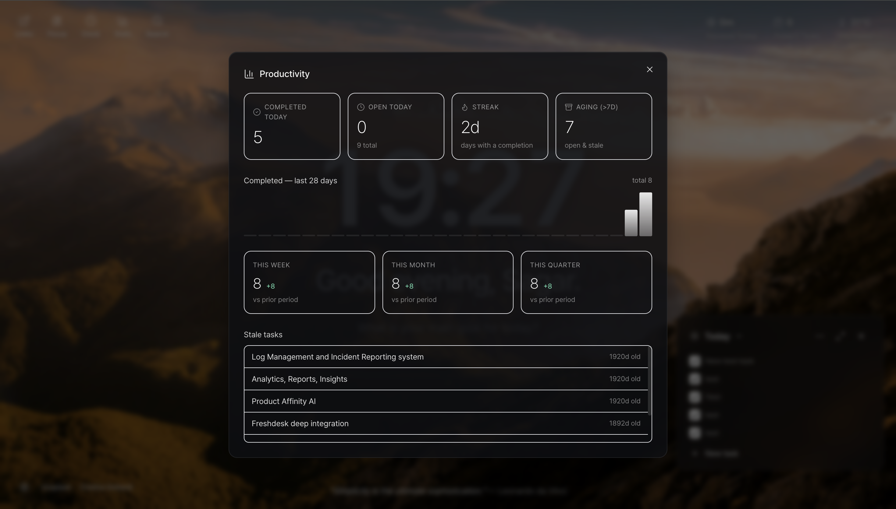
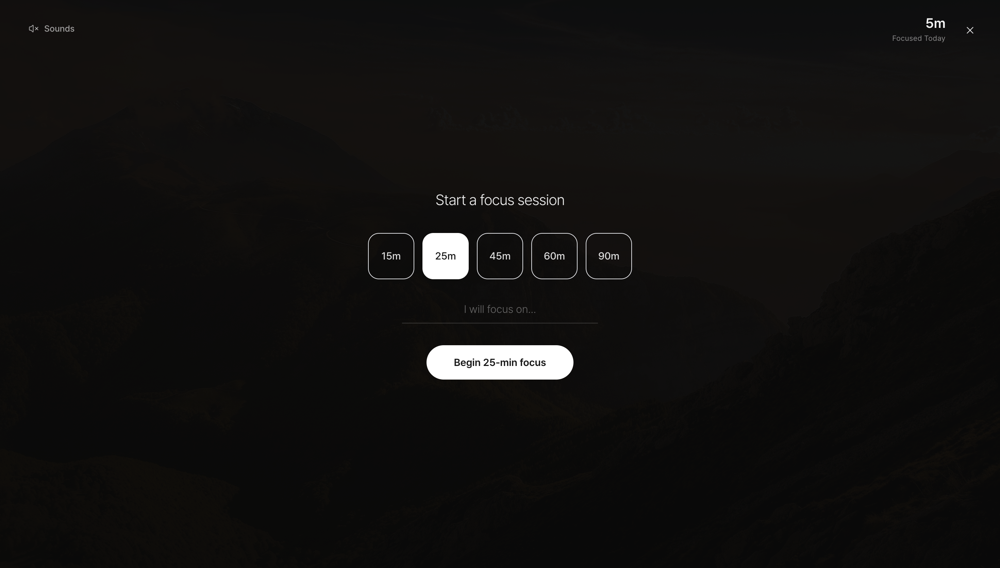

# Moment — A Beautiful New Tab

<p align="center">
  <a href="https://chromewebstore.google.com/detail/moment/TODO_REPLACE_WITH_CWS_ID">
    
  </a>
  <a href="https://github.com/sagarchauhan005/moment/releases">
    
  </a>
  <a href="LICENSE">
    
  </a>
</p>

**Moment** is an open-source alternative to [Momentum](https://chromewebstore.google.com/detail/momentum/laookkfknpbbblfpciffpaejjkokdgca): a calm new-tab dashboard with wallpapers, tasks, focus timer, and integrations — without locking project-management features behind a paywall.

---

## Screenshots

<p align="center">
  
  
  
  <br />
  
  
  
</p>

---

## Features

| Feature | Details |
|---------|---------|
| **Daily wallpaper** | Unsplash landscapes — click the footer label to refresh |
| **Task inbox** | Inbox / Today / Completed tabs · Priority · Drag-to-reorder · Inline editing · Right-click context menu |
| **Focus mode** | Countdown timer · Rainfall ambient sound (auto-plays on start) · Switchable sound grid · Soft site-block overlay for distraction sites |
| **Asana & Linear** | Optional sync via your own API tokens · Tasks created locally can be pushed · Completions, renames, and deletes propagate back |
| **Weather** | Current temperature + city via Open-Meteo (no API key needed) |
| **World clock** | Multiple IANA timezones in the top bar |
| **Search** | Google · DuckDuckGo · Bing (`/` or `⌘K` / `Ctrl+K`) |
| **Stats** | Daily focus minutes · Tasks completed · Trend charts |

---

## Install

### From the Chrome Web Store _(recommended)_

> **Coming soon** — submission in progress.  
> Star / watch this repo to be notified when it goes live.

### Load unpacked (Developer mode)

```bash
git clone https://github.com/sagarchauhan005/moment.git
cd moment
npm install
npm run build
```

1. Open `chrome://extensions`
2. Enable **Developer mode** (top-right toggle)
3. Click **Load unpacked** → select the `dist/` folder
4. Open a new tab

---

## Configuration

Open the settings panel via the **⚙ gear icon** (bottom-left of the new tab):

| Setting | Where to get it |
|---------|----------------|
| **Your name** | Just type it |
| **UI font** | Any [Google Font](https://fonts.google.com) name |
| **Unsplash access key** | [unsplash.com/developers](https://unsplash.com/developers) → New Application |
| **Linear API key** | Linear → Settings → Account → API → Personal API keys |
| **Asana personal token** | Asana → My Profile → Apps → Manage Developer Apps → New token |
| **Focus block-list** | Hostnames (e.g. `twitter.com`) shown in the soft-block overlay during focus |
| **World clock cities** | Label + IANA timezone string |
| **Search engine** | Google / DuckDuckGo / Bing |
| **Units** | Metric / Imperial (weather) |

---

## Ambient sounds

Only **Rainfall** is bundled in v0.1. To add more sounds:

1. Download a loopable MP3 (e.g. from [freesound.org](https://freesound.org))
2. Place it in `src/assets/sounds/` with the matching filename (`ocean.mp3`, `forest.mp3`, `white-noise.mp3`, `brown-noise.mp3`, `binaural.mp3`)
3. Add a matching import + entry in `BUNDLED` inside `src/lib/sounds.ts`
4. Run `npm run build`

---

## Architecture

```
src/
  background/     MV3 service worker — alarms, Asana/Linear sync, focus end
  content/        Focus Gate soft-block content script
  newtab/         React new-tab UI (components, hooks, pages)
  options/        Settings page
  lib/            Shared logic — storage, tasks, sounds, Asana, Linear, Unsplash, …
  assets/         Icons, bundled audio
```

State lives entirely in `chrome.storage.local`. The `useMoment` hook subscribes to `onChanged` for live reactive updates across tabs.

---

## Development

```bash
npm run dev     # Vite dev server + watch — reload the unpacked extension after each save
npm run build   # Production build → dist/
npm run lint    # TypeScript type-check (no emit)
```

---

## Privacy

No data leaves your device except to the services you explicitly configure (Asana, Linear) or enable (Unsplash wallpapers, Open-Meteo weather). No analytics, telemetry, or ad networks.

→ Full policy: [PRIVACY.md](PRIVACY.md)

---

## Roadmap

- [ ] Calendar integration
- [ ] More ambient sound presets
- [ ] More project-management integrations (Jira, GitHub Issues, Todoist)
- [ ] Offline wallpaper fallback gallery

---

## Contributors

<!-- ALL-CONTRIBUTORS-LIST:START -->
<table>
  <tr>
    <td align="center">
      <a href="https://github.com/sagarchauhan005">
        <br />
        <sub><b>Sagar Chauhan</b></sub>
      </a><br />
      <sub>Author &amp; Maintainer</sub>
    </td>
    <td align="center">
      <a href="https://www.anthropic.com/claude">
        <br />
        <sub><b>Claude</b></sub>
      </a><br />
      <sub>AI Development Assistant</sub>
    </td>
  </tr>
</table>
<!-- ALL-CONTRIBUTORS-LIST:END -->

PRs are welcome. For significant changes, open an issue first to discuss.

---

## License

[MIT](LICENSE) — do whatever you like.
